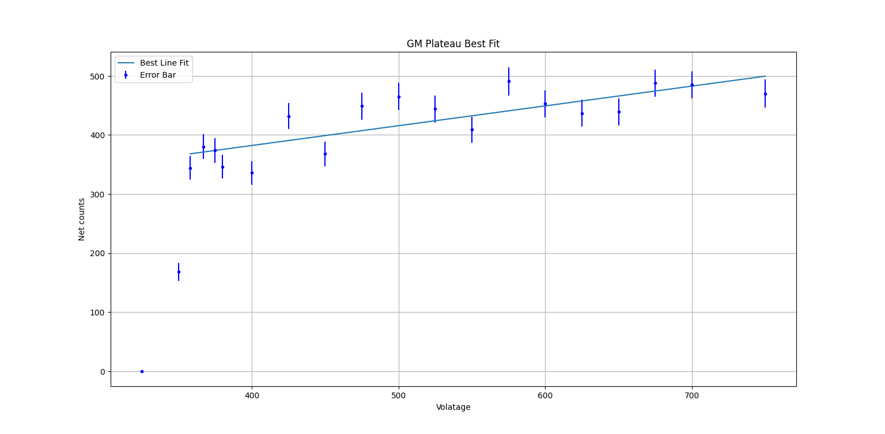
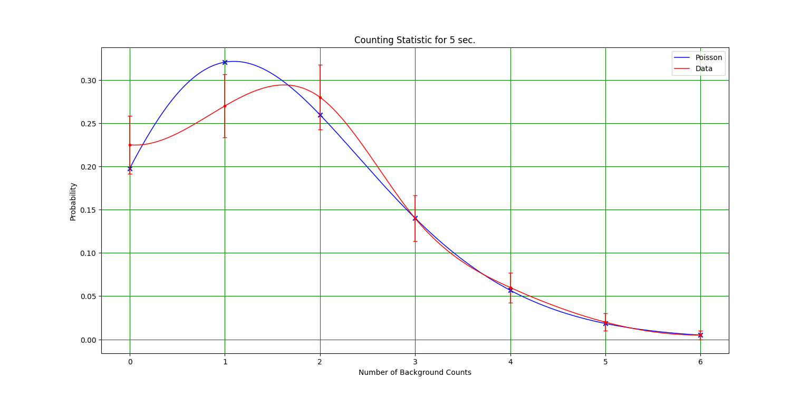
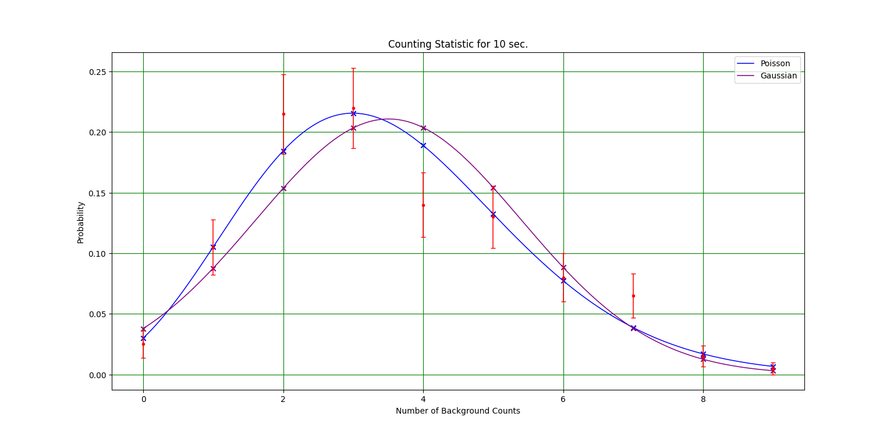
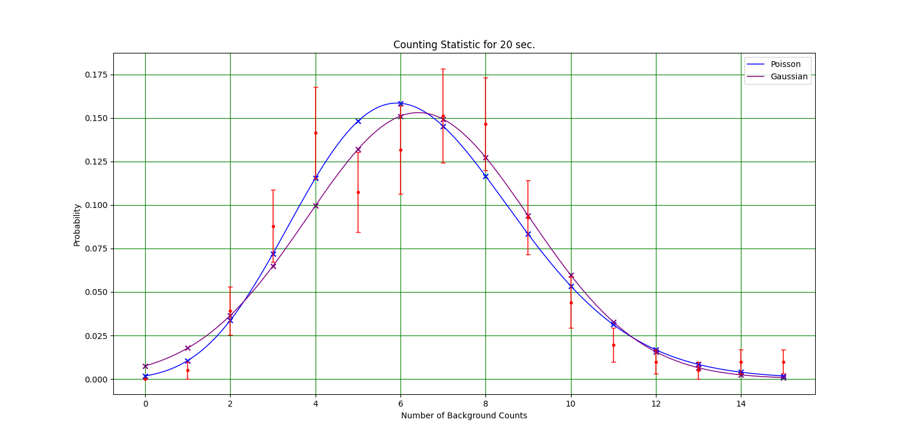

# GM Counter Characteristics & Counting Statistics Analysis
**Geiger–Müller Tube Plateau Curve, Poisson vs Gaussian Fitting, and Chi-Square Hypothesis Testing**

---

## 📌 Overview
This project analyzes the behavior of a Geiger–Müller (GM) radiation detector through:

- GM plateau curve measurement  
- Operating voltage selection  
- Counting statistics at **5 s**, **10 s**, and **20 s**  
- Fitting experimental data to **Poisson** and **Gaussian** distributions  
- Performing **chi-square goodness-of-fit tests**  
- Computing **right-tail probabilities (p-values)**  
- Visualizing distributions using Python  

This project demonstrates **experimental data analysis**, **statistical modeling**, and **scientific computation skills**.

---

## ⚡ GM Plateau Curve

**Figure 1 — GM Plateau Curve:**  
The plateau region appears between **480–580 V**, where the GM tube count rate becomes nearly constant.  
A linear fit across this region yields a small slope, indicating stable operation.  
The chosen operating voltage for counting measurements is **540 V**, near the plateau center.

---

## 📊 Counting Statistics Analysis

### 5-Second Interval

**Figure 2 — 5-Second Counting Statistics:**  
The measured distribution matches the Poisson model extremely well.  
- Mean = **1.62**  
- Chi-square (Poisson) = **2.72**  
- Right-tail p ≈ **0.84**  
Gaussian approximation is not used due to low mean.

---

### 10-Second Interval

**Figure 3 — 10-Second Counting Statistics:**  
Poisson provides a significantly better fit than Gaussian.  
- Mean = **3.505**  
- Chi-square (Poisson) = **7.44** (p ≈ 0.5916)  
- Chi-square (Gaussian) = **15.69** (p ≈ 0.0737)

---

### 20-Second Interval

**Figure 4 — 20-Second Counting Statistics:**  
Even at higher mean counts, Poisson remains the superior model.  
- Mean = **6.419**  
- Chi-square (Poisson) = **21.23** (p ≈ 0.1294)  
- Chi-square (Gaussian) = **44.44** (p ≈ 9.35×10⁻⁵) → Gaussian rejected

---

## 📐 Chi-Square Results Summary

| Interval | Mean | χ² (Poisson) | p-value (Poisson) | χ² (Gaussian) | p-value (Gaussian) | Best Fit |
|---------|------|--------------|-------------------|----------------|---------------------|----------|
| 5 sec   | 1.62 | 2.72         | 0.8429            | —              | —                   | Poisson |
| 10 sec  | 3.505| 7.44         | 0.5916            | 15.69          | 0.0737              | Poisson |
| 20 sec  | 6.419| 21.23        | 0.1294            | 44.44          | 9.35×10⁻⁵           | Poisson |

---

## 🧪 Conclusion
- GM tube counts follow the **Poisson distribution** at all tested intervals.  
- Gaussian model fails, especially at low and medium means.  
- Plateau region accurately identified at **480–580 V**.  
- Operating voltage set at **540 V** ensures stability for counting experiments.  
- Statistical tests confirm radioactive decay as an independent, random process.

---

## 🛠️ Skills Demonstrated
- Poisson & Gaussian probability distribution modeling  
- Chi-square hypothesis testing  
- Error analysis and uncertainty propagation  
- Scientific visualization (Matplotlib)  
- Experimental data processing and validation  
- Statistical reasoning and interpretation  
- Python-based scientific computing  
- Research-style documentation  

---

## 👤 Author
**Debayan Mal**  
Physics & Data Analysis Project
